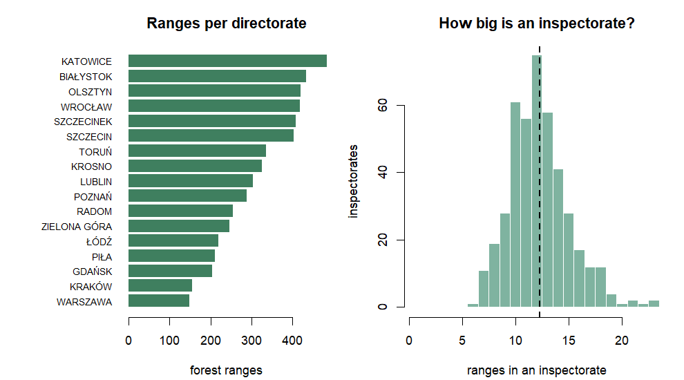
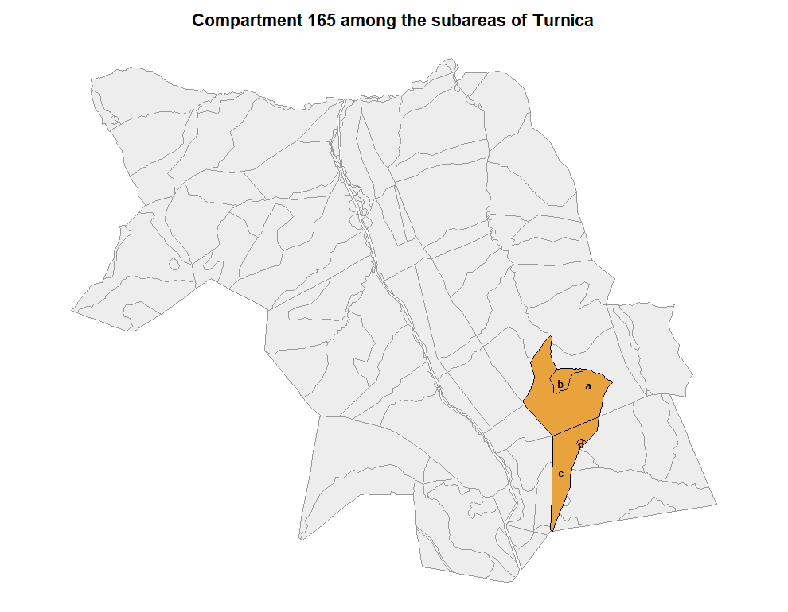

# Forest data: the BDL side

The Forest Data Bank publishes the State Forests’ administrative
hierarchy and its subareas. None of it needs a VPN.

``` r

library(rgeopl)
```

## The hierarchy, and the key that runs through it

Four levels, and every object at every level carries the same key: the
forest address.

``` r

parse_forest_address(c("04",
                       "04-02",
                       "04-02-2-11",
                       "04-02-2-11-165   -a   -00"))
#>   directorate_cd inspectorate_cd obreb_cd range_cd compartment subarea part
#> 1             04            <NA>     <NA>     <NA>        <NA>    <NA> <NA>
#> 2             04              02     <NA>     <NA>        <NA>    <NA> <NA>
#> 3             04              02        2       11        <NA>    <NA> <NA>
#> 4             04              02        2       11         165       a   00
```

Twenty-five characters, seven fixed-width fields, and the higher levels
leave the lower ones blank rather than omitting them – so the positions
never move and a truncated address is still a valid one. That is what
makes the address usable as a search term.

## Listing the country

The name tables are small and are fetched without geometry, which keeps
them quick enough to work with interactively.

``` r

bdl_overview()
#>    directorate_cd directorate_name inspectorates ranges edition_min edition_max
#> 01             01        BIAŁYSTOK            31    433        2026        2026
#> 02             02         KATOWICE            38    484        2026        2026
#> 03             03           KRAKÓW            16    155        2026        2026
#> 04             04           KROSNO            26    326        2026        2026
#> 05             05           LUBLIN            25    304        2026        2026
#> 06             06             ŁÓDŹ            19    220        2026        2026
#> 07             07          OLSZTYN            32    420        2026        2026
#> 08             08             PIŁA            20    211        2026        2026
#> 09             09           POZNAŃ            25    289        2026        2026
#> 10             10         SZCZECIN            35    403        2026        2026
#> 11             11       SZCZECINEK            30    408        2026        2026
#> 12             12            TORUŃ            27    335        2026        2026
#> 13             13          WROCŁAW            33    418        2026        2026
#> 14             14     ZIELONA GÓRA            20    246        2026        2026
#> 15             15           GDAŃSK            15    205        2026        2026
#> 16             16            RADOM            23    254        2026        2026
#> 17             17         WARSZAWA            14    148        2026        2026
#> 1              --           POLAND           429   5259        2026        2026
```

``` r

inspectorates <- bdl_catalogue("inspectorate")
ranges <- bdl_catalogue("range")
head(ranges, 4)
#>    directorate_cd directorate_name inspectorate_cd inspectorate_name obreb_cd
#> 18             01        BIAŁYSTOK              01          Augustów        1
#> 1              01        BIAŁYSTOK              01          Augustów        1
#> 20             01        BIAŁYSTOK              01          Augustów        1
#> 5              01        BIAŁYSTOK              01          Augustów        1
#>    range_cd    range_name    adr_for year
#> 18       01      Lipowiec 01-01-1-01 2026
#> 1        02 Studzieniczna 01-01-1-02 2026
#> 20       03   Czarny Bród 01-01-1-03 2026
#> 5        04       Sajenek 01-01-1-04 2026
```

Structure falls out of that directly:

``` r

per_inspectorate <- as.integer(table(paste(ranges$directorate_cd, ranges$inspectorate_cd)))
summary(per_inspectorate)
#>    Min. 1st Qu.  Median    Mean 3rd Qu.    Max. 
#>    6.00   10.00   12.00   12.26   14.00   23.00

sort(table(ranges$inspectorate_name), decreasing = TRUE)[1:6]
#> 
#>            Pisz          Żednia Oleśnica Śląska          Bircza  Janów Lubelski 
#>              23              23              22              21              21 
#>          Głogów 
#>              20
```

``` r

op <- par(mfrow = c(1, 2), mar = c(4.2, 8.5, 3, 1))
ov <- bdl_overview(); ov <- ov[ov$directorate_cd != "--", ]
o <- ov[order(ov$ranges), ]
barplot(o$ranges, names.arg = o$directorate_name, horiz = TRUE, las = 1,
        cex.names = 0.75, col = "#3f7f5f", border = NA,
        xlab = "forest ranges", main = "Ranges per directorate")
par(mar = c(4.2, 4.2, 3, 1))
hist(per_inspectorate, breaks = seq(0.5, max(per_inspectorate) + 0.5, 1),
     col = "#7fb3a0", border = "white", xlab = "ranges in an inspectorate",
     ylab = "inspectorates", main = "How big is an inspectorate?")
abline(v = mean(per_inspectorate), lty = 2, lwd = 2)
```



plot of chunk national-structure

``` r

par(op)
```

A warning about the `year` column while it is in view: it is the
**edition stamp of the BDL release**, identical across the whole
country, not the year a unit’s management plan was revised. It reads
2026 for all 429 inspectorates. BDL publishes the current state and
nothing else – there is no archive here, and no field to tell old data
from new. That is the one respect in which it is poorer than the GUGiK
indexes, where every vintage stays available and queryable.

## Finding a unit

By name, ignoring case and Polish diacritics:

``` r

metkow <- bdl_unit(inspectorate = "Chrzanow", range = "Metkow")
#> Looking up the range name table...
#>   fetching 1 geometry
sf::st_drop_geometry(metkow)
#> <rgeopl BDL range lookup: 1 features>
#>   inspectorates: Chrzanów
#>   plan vintages: 2026  (current state only, not an archive)
#>   directorate_cd directorate_name inspectorate_cd inspectorate_name obreb_cd
#> 1             02         KATOWICE              07          Chrzanów        1
#>   range_cd range_name compartment subarea part                 adr_for year
#> 1       03     Mętków        <NA>    <NA> <NA> 02-07-1-03-      -    - 2026
```

Or by address, at whatever depth you have. The most specific level you
give is the one you get back:

``` r

bdl_by_address("04-02-2")$range_name
#> Looking up lesnictwa by address...
#>   6 unit(s) match; fetching geometry
#> [1] "Sierakośce"       "Pechnów"          "Turnica"          "Posada Rybotycka"
#> [5] "Borysławka"       "Leszczyny"
```

Below the forest range there is no index to query directly, so the range
is resolved first and its subareas filtered locally – which keeps the
request bounded at hundreds of features rather than hundreds of
thousands.

``` r

compartment <- bdl_by_address("04-02-2-11-165")
#> Resolving the forest range 04-02-2-11 first...
#>   RDLP_Krosno_wydzielenia: 381 features
#>   381 subareas, plan vintages 2026-2026
#>   4 subarea(s) match
sf::st_drop_geometry(compartment)[, c("adr_for", "area_ha", "species",
                                "species_age", "site_type")]
#> <rgeopl BDL layer: 4 features>
#>                       adr_for area_ha species species_age site_type
#> 77  04-02-2-11-165   -a   -00   25.87      BK         104      LGŚW
#> 277 04-02-2-11-165   -d   -00    0.26    <NA>           0      <NA>
#> 336 04-02-2-11-165   -c   -00   12.53      BK         149      LGŚW
#> 340 04-02-2-11-165   -b   -00    2.75      BK          99      LGŚW
```

Wrong names and wrong compartments are answered with what does exist:

``` r

bdl_unit(inspectorate = "Bircza", range = "Kopysno")
#> Looking up the range name table...
#> Error:
#> ! No range called `Kopysno`. Did you mean: Kopalina, Kopalino, Kopaliny, Kopaniec, Kopaniewo, Kopanina?
```

## Subareas over an area

``` r

aoi <- as_aoi(sf::st_read(rgeopl_example("gleboczek_aoi.shp"), quiet = TRUE))
subareas <- bdl_subareas(aoi)
#>   area spans 2 regional directorates
#>   RDLP_Torun_wydzielenia: 267 features
#>   dropped 57 subareas that met the bounding box but not the area
#>   210 subareas, plan vintages 2026-2026
```

``` r

d <- sf::st_drop_geometry(subareas)
sp <- aggregate(area_ha ~ species, data = d[!is.na(d$species), ], FUN = sum)
head(sp[order(-sp$area_ha), ], 6)
#>   species area_ha
#> 8      SO  763.05
#> 3      DB  131.05
#> 7      MD   28.76
#> 5      DG    6.07
#> 6      JW    4.30
#> 9      ŚW    1.82
```

Compartments are not published as vectors at all – they exist only as a
WMS picture.
[`bdl_compartments()`](https://igorpawelec.github.io/rgeopl/reference/bdl_directorates.md)
derives them by dissolving subareas on the compartment field of the
address, which is also self-consistent by construction:

``` r

compartments <- bdl_compartments(aoi, quiet = TRUE)
head(sf::st_drop_geometry(compartments)[, c("inspectorate_name", "range_name", "compartment",
                                      "subareas", "area_ha", "area_geom_ha")], 5)
#> <rgeopl BDL layer: 5 features>
#>   inspectorates: Gołąbki
#>     inspectorate_name range_name compartment subareas area_ha area_geom_ha
#> 4             Gołąbki    Oćwieka          52        4   10.28        10.40
#> 57            Gołąbki    Oćwieka          53        3    6.56         6.64
#> 261           Gołąbki    Oćwieka          54        2   29.11        29.49
#> 252           Gołąbki    Oćwieka          55        5   23.80        24.70
#> 251           Gołąbki    Oćwieka          56        4   17.48        17.52
```

Two area columns, deliberately apart: `area_ha` is what the management
plan records, `area_geom_ha` is what the polygons enclose. They differ
by around a percent, and merging them would hide that.

## The trap: an address is not a polygon

A forest range’s outline and the set of subareas addressed to it are not
the same thing.

``` r

turnica <- bdl_by_address("04-02-2-11", quiet = TRUE)

by_polygon <- bdl_subareas(turnica, quiet = TRUE)
by_address <- bdl_subareas(turnica, within_aoi = FALSE, quiet = TRUE)
by_address <- subset(by_address, directorate_cd == "04" & inspectorate_cd == "02" &
                                 obreb_cd == "2" & range_cd == "11")

data.frame(
  selection = c("addressed to the range", "inside its polygon"),
  subareas = c(nrow(by_address), nrow(by_polygon)),
  area_ha = round(c(sum(by_address$area_ha, na.rm = TRUE),
                    sum(by_polygon$area_ha, na.rm = TRUE)), 1)
)
#>                selection subareas area_ha
#> 1 addressed to the range      144  1186.6
#> 2     inside its polygon      194  1615.2
```

Fifty subareas lying inside Turnica’s outline belong, by address, to
four neighbouring ranges. Taking the outline as the definition of the
unit’s contents overstates its area by 36%.

Both readings are available on purpose. `bdl_subareas(aoi)` filters by
geometry, because “what is on this ground” is a spatial question.
[`bdl_by_address()`](https://igorpawelec.github.io/rgeopl/reference/bdl_by_address.md)
filters by address, because “what belongs to this unit” is an
administrative one. Pick the one that matches the question.

``` r

plot_units(compartment, label = "subarea", context = by_address, fill = "#e8a33d",
           border = "black", main = "Compartment 165 among the subareas of Turnica")
```



plot of chunk turnica-compartment

## What is not here

- **No archive**, and no vintage field, as above.
- **No attribute filtering server-side.** `forest_range_name=Metkow`
  returns zero features whatever the spelling, which is why lookups go
  through a cached name table instead.
- **No names on the subareas.** They carry codes only, so the
  directorate, inspectorate and range names are joined in from the code
  tables.
