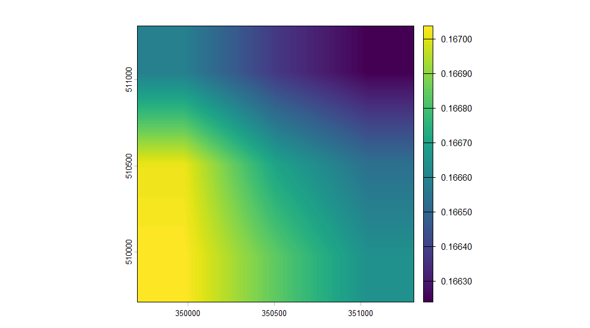
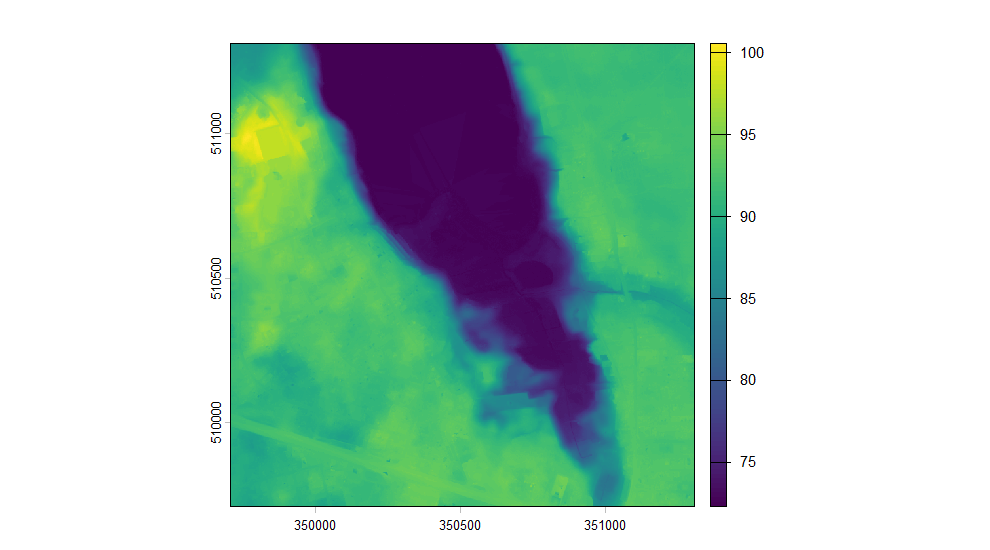

# Heights, and the two systems Poland measures them in

Poland changed the system its heights are measured in, and the archive
holds both. Two elevation models of the same ground can differ by about
17 cm for no reason but the datum, and nothing in either file says so.

``` r

library(rgeopl)
library(terra)
#> terra 1.9.34

aoi <- as_aoi(c(16.80, 52.44), buffer = 800)
dem <- dem_request(aoi, format = "grid", quiet = TRUE)

unique(sf::st_drop_geometry(dem)[dem$product == "DTM", c("year", "VRS")])
#> <rgeopl index index: 8 tiles>
#>   vintages: 2012, 2019, 2020, 2021, 2022, 2023, 2024, 2025
#>   note:     mixed vertical datums (PL-EVRF2007-NH, PL-KRON86-NH)
#>     year            VRS
#> 1   2022 PL-EVRF2007-NH
#> 8   2021 PL-EVRF2007-NH
#> 32  2020 PL-EVRF2007-NH
#> 46  2019 PL-EVRF2007-NH
#> 97  2012   PL-KRON86-NH
#> 118 2023 PL-EVRF2007-NH
#> 121 2024 PL-EVRF2007-NH
#> 123 2025 PL-EVRF2007-NH
```

The index says which system each tile is in, in its `VRS` column, and
the change is visible in it: everything up to 2019 is `PL-KRON86-NH`,
everything after is `PL-EVRF2007-NH`.

## What the difference is

Measured across the country, an EVRF2007 height is 13.6 to 19.2 cm above
the KRON86 height of the same ground, and by how much depends on where
you are.

``` r

terrain <- tile_mosaic(
  subset(dem, product == "DTM" & year == 2012),
  aoi, crop = "aoi", quiet = TRUE
)

converted <- dem_to_datum(terrain, from = "kron86", to = "evrf2007",
                          quiet = TRUE)

plot(converted - terrain, main = "")
```



plot of chunk shift

That is the whole correction, and it is smooth: it is the difference
between two quasi-geoid models, so it changes by centimetres across the
country and by almost nothing across a stand.

## Why `st_transform()` is not the answer

PROJ knows the right transformation and lists it at 0.04 m accuracy, but
cannot obtain the grid it needs. Asked to convert anyway it offers a
second candidate and takes it:

``` r

p <- sf::sf_proj_pipelines("EPSG:2180+9650", "EPSG:2180+9651")
p[, c("accuracy", "instantiable")]
#> Candidate coordinate operations found:  2 
#> Strict containment:     
#> Axis order auth compl:  
#> Source:  
#> Target:  
#> Best instantiable operation has only ballpark accuracy 
#> Description: 
#> Definition:
```

The one it can instantiate is `+proj=noop`. It does nothing: the heights
come back unchanged and relabelled, which is worse than an error,
because nothing about the result looks wrong.
[`dem_to_datum()`](https://igorpawelec.github.io/rgeopl/reference/dem_to_datum.md)
goes up to the ellipsoid through one quasi-geoid model and back down
through the other instead, and refuses rather than guessing if the grids
cannot be reached, if the area lies outside them, or if the computed
shift is exactly zero everywhere.

## When it matters, and when it does not

A canopy model does not need any of this. Surface and terrain are
measured in the same system and it cancels in the subtraction — as long
as both halves come from the same survey.

That last clause is the trap. The terrain is remapped far more often
than the surface, so the newest of each is often two different flights:

``` r

bialowieza <- as_aoi(c(23.85, 52.70), buffer = 1500)
bdem <- dem_request(bialowieza, format = "grid", quiet = TRUE)

unique(sf::st_drop_geometry(bdem)[bdem$product %in% c("DSM", "DTM"),
                                  c("product", "year", "VRS")])
#> <rgeopl index index: 6 tiles>
#>   vintages: 2018, 2022, 2024, 2025
#>   products: DTM, DSM
#>   note:     mixed vertical datums (PL-EVRF2007-NH, PL-KRON86-NH)
#>    product year            VRS
#> 1      DTM 2022 PL-EVRF2007-NH
#> 6      DTM 2018   PL-KRON86-NH
#> 7      DSM 2018   PL-KRON86-NH
#> 22     DTM 2024 PL-EVRF2007-NH
#> 49     DSM 2025 PL-EVRF2007-NH
#> 50     DTM 2025 PL-EVRF2007-NH
```

Take the newest surface and the newest terrain here and they straddle
the change of datum. Subtract them as they come and every canopy is
about 16 cm too short, uniformly, on top of the real growth between the
flights.

[`chm_years()`](https://igorpawelec.github.io/rgeopl/reference/chm_years.md)
avoids the question by only offering vintages that hold both:

``` r

chm_years(bialowieza, quiet = TRUE)
#>   year resolution surface terrain
#> 2 2025          1       1       1
#> 1 2018          1       5       5
```

When you are assembling the two halves yourself,
[`chm_build()`](https://igorpawelec.github.io/rgeopl/reference/chm_get.md)
takes their systems and converts before subtracting:

``` r

chm_build(surface, terrain, vrs = c("kron86", "evrf2007"))
```

Rasters carry no vertical system, so this cannot be worked out from
them. The index knows; you have to pass it on.

## Joining terrain across the boundary

[`tile_mosaic()`](https://igorpawelec.github.io/rgeopl/reference/tile_mosaic.md)
refuses a selection that mixes vertical datums, because the seam would
be a step in the ground that is not there. It is the one refusal with a
way through: name the system you want to land in and it converts one
side rather than refusing.

``` r

sel <- subset(dem, product == "DTM" & resolution == 1 & year %in% c(2012, 2019))
sel <- sel[!duplicated(paste(sel$sheetID, sel$year)), ]

table(sel$year, sel$VRS)
#>       
#>        PL-EVRF2007-NH PL-KRON86-NH
#>   2012              0            2
#>   2019              2            0
```

``` r

tile_mosaic(sel, aoi, quiet = TRUE)
#> Error:
#> ! These tiles do not belong in one mosaic. They disagree on
#>   - vintage: 2012, 2019
#>   - vertical datum: PL-EVRF2007-NH, PL-KRON86-NH
#> Filter the index to one of each, or pass allow_mixed = TRUE if the mixture is deliberate.
```

``` r

joined <- tile_mosaic(sel, aoi, crop = "aoi", datum = "evrf2007", quiet = TRUE)

joined
#> class       : SpatRaster
#> size        : 1600, 1600, 1  (nrow, ncol, nlyr)
#> resolution  : 1, 1  (x, y)
#> extent      : 349708.5, 351308.5, 509710.5, 511310.5  (xmin, xmax, ymin, ymax)
#> coord. ref. : ETRF2000-PL / CS92 (EPSG:2180)
#> source(s)   : memory
#> varname     : file521c5a0f13a3
#> name        :       DTM
#> min value   : 72.230003
#> max value   :    100.57
plot(joined, main = "")
```



plot of chunk joined

Naming a datum also accepts the mixture of vintages that comes with it —
two vertical systems are two flights, and there is no way to have one
without the other. Everything else the selection must agree on still
applies, so each side still has to be one product at one resolution.
