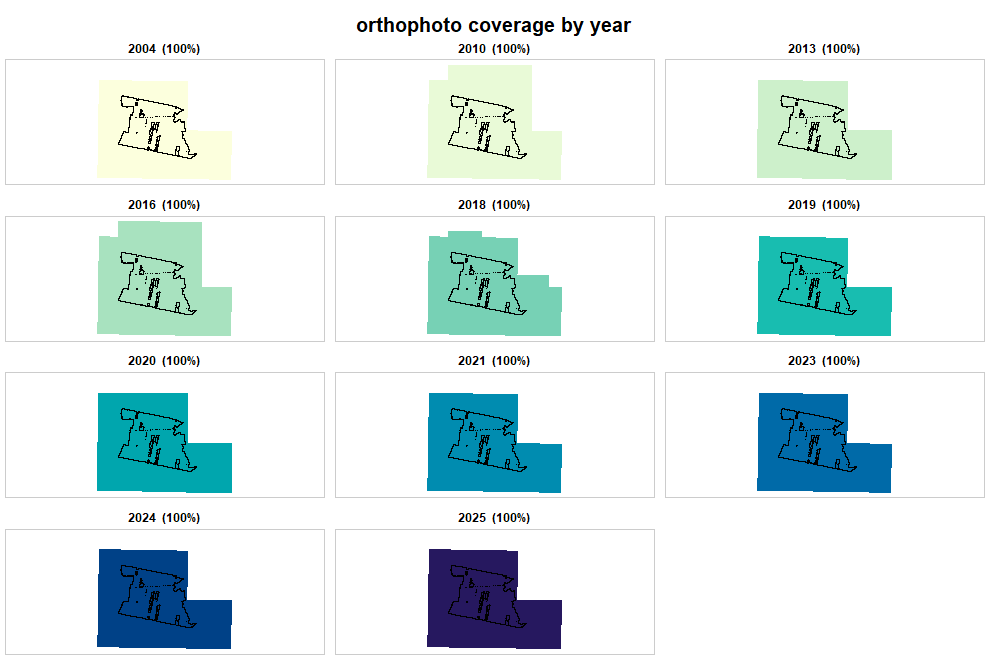

# Getting started


Every question in this package has the same shape: *what exists here, and which
of it do I want?* Asking is one step, downloading is another, and nothing is
fetched until you say so.


``` r
library(rgeopl)
```

## An area of interest

`as_aoi()` takes whatever you already have. A point and a radius:


``` r
as_aoi(c(16.93, 52.41), buffer = 500)
#> <rgeopl area of interest>
#>   type:     area
#>   features: 1
#>   CRS:      EPSG:2180
#>   bbox:     358745.4, 506413.6, 359745.4, 507413.6 (EPSG:2180)
```

The CRS was not given and did not need to be: those coordinates fall inside
Poland's longitude/latitude window, and the PL-1992 window does not overlap it.
Coordinates outside both are refused rather than guessed at.

Files work too. The package ships two real areas to experiment on:


``` r
rgeopl_example()
#> [1] "gleboczek_aoi.shp" "test_lasow.shp"

aoi <- as_aoi(sf::st_read(rgeopl_example("gleboczek_aoi.shp"), quiet = TRUE))
aoi
#> <rgeopl area of interest>
#>   type:     area
#>   features: 2
#>   CRS:      EPSG:2180
#>   bbox:     416481.7, 535097.9, 420166.4, 538071.9 (EPSG:2180)
```

Two polygons, about 600 ha, near Gniezno. `sf` objects, `terra` objects,
bounding boxes, coordinate matrices and WKT strings are all accepted.

## What exists here

Three indexes, one per kind of product. Nothing is downloaded; each returns one
row per tile, with the tile outline as geometry.


``` r
dem <- dem_request(aoi)
#> Querying the elevation index...
#>   dropped 23 tiles that met the bounding box but not the area
#>   96 tiles, 10 vintages (2004-2025)
ort <- ortho_request(aoi)
#> Querying the orthophoto index...
#>   dropped 20 tiles that met the bounding box but not the area
#>   98 tiles, 11 vintages (2004-2025)
```


``` r
dem
#> <rgeopl elevation index: 96 tiles>
#>   vintages: 2004, 2010, 2014, 2016, 2019, 2020, 2021, 2023, 2024, 2025
#>   products: DTM, DSM, PointCloud
#>   note:     mixed vertical datums (PL-EVRF2007-NH, PL-KRON86-NH)
#> Simple feature collection with 96 features and 16 fields
#> Geometry type: POLYGON
#> Dimension:     XY
#> Bounding box:  xmin: 415494.5 ymin: 534033.4 xmax: 424017.1 ymax: 538805.9
#> Projected CRS: ETRF2000-PL / CS92
#> First 10 features:
#>             sheetID year product              format resolution density
#> 1  N-33-120-D-c-4-3 2021     DTM ARC/INFO ASCII GRID          5      NA
#> 2  N-33-120-D-c-3-3 2021     DTM ARC/INFO ASCII GRID          5      NA
#> 3  N-33-120-D-c-3-1 2021     DTM ARC/INFO ASCII GRID          5      NA
#> 5  N-33-120-D-c-3-4 2021     DTM ARC/INFO ASCII GRID          5      NA
#> 6  N-33-120-D-c-3-2 2021     DTM ARC/INFO ASCII GRID          5      NA
#> 7  N-33-120-D-c-3-3 2020     DTM ARC/INFO ASCII GRID          5      NA
#> 8  N-33-120-D-c-3-4 2020     DTM ARC/INFO ASCII GRID          5      NA
#> 9  N-33-120-D-c-3-2 2020     DTM ARC/INFO ASCII GRID          5      NA
#> 11 N-33-120-D-c-3-1 2020     DTM ARC/INFO ASCII GRID          5      NA
#> 12 N-33-120-D-c-4-3 2020     DTM ARC/INFO ASCII GRID          5      NA
#>          source     CRS            VRS avgElevErr avgPlanarErr       date
#> 1  Aerial photo PL-1992 PL-EVRF2007-NH        0.6         0.75 2021-06-04
#> 2  Aerial photo PL-1992 PL-EVRF2007-NH        0.6         0.75 2021-06-04
#> 3  Aerial photo PL-1992 PL-EVRF2007-NH        0.6         0.75 2021-06-04
#> 5  Aerial photo PL-1992 PL-EVRF2007-NH        0.6         0.75 2021-06-04
#> 6  Aerial photo PL-1992 PL-EVRF2007-NH        0.6         0.75 2021-06-04
#> 7  Aerial photo PL-1992 PL-EVRF2007-NH        0.5         0.75 2020-09-16
#> 8  Aerial photo PL-1992 PL-EVRF2007-NH        0.5         0.75 2020-09-16
#> 9  Aerial photo PL-1992 PL-EVRF2007-NH        0.5         0.75 2020-09-16
#> 11 Aerial photo PL-1992 PL-EVRF2007-NH        0.5         0.75 2020-09-16
#> 12 Aerial photo PL-1992 PL-EVRF2007-NH        0.5         0.75 2020-09-16
#>    isFilled seriesID                       filename
#> 1      TRUE    74964 74964_1081535_N-33-120-D-c-4-3
#> 2      TRUE    74964 74964_1081531_N-33-120-D-c-3-3
#> 3      TRUE    74964 74964_1081529_N-33-120-D-c-3-1
#> 5      TRUE    74964 74964_1081532_N-33-120-D-c-3-4
#> 6      TRUE    74964 74964_1081530_N-33-120-D-c-3-2
#> 7      TRUE    73804 73804_1033127_N-33-120-D-c-3-3
#> 8      TRUE    73804 73804_1033128_N-33-120-D-c-3-4
#> 9      TRUE    73804 73804_1033126_N-33-120-D-c-3-2
#> 11     TRUE    73804 73804_1033125_N-33-120-D-c-3-1
#> 12     TRUE    73804 73804_1033131_N-33-120-D-c-4-3
#>                                                                                          URL
#> 1  https://opendata.geoportal.gov.pl/NumDaneWys/NMT/74964/74964_1081535_N-33-120-D-c-4-3.asc
#> 2  https://opendata.geoportal.gov.pl/NumDaneWys/NMT/74964/74964_1081531_N-33-120-D-c-3-3.asc
#> 3  https://opendata.geoportal.gov.pl/NumDaneWys/NMT/74964/74964_1081529_N-33-120-D-c-3-1.asc
#> 5  https://opendata.geoportal.gov.pl/NumDaneWys/NMT/74964/74964_1081532_N-33-120-D-c-3-4.asc
#> 6  https://opendata.geoportal.gov.pl/NumDaneWys/NMT/74964/74964_1081530_N-33-120-D-c-3-2.asc
#> 7  https://opendata.geoportal.gov.pl/NumDaneWys/NMT/73804/73804_1033127_N-33-120-D-c-3-3.asc
#> 8  https://opendata.geoportal.gov.pl/NumDaneWys/NMT/73804/73804_1033128_N-33-120-D-c-3-4.asc
#> 9  https://opendata.geoportal.gov.pl/NumDaneWys/NMT/73804/73804_1033126_N-33-120-D-c-3-2.asc
#> 11 https://opendata.geoportal.gov.pl/NumDaneWys/NMT/73804/73804_1033125_N-33-120-D-c-3-1.asc
#> 12 https://opendata.geoportal.gov.pl/NumDaneWys/NMT/73804/73804_1033131_N-33-120-D-c-4-3.asc
#>                          geometry
#> 1  POLYGON ((419748.3 535838.6...
#> 2  POLYGON ((415524.7 535910.1...
#> 3  POLYGON ((415564.9 538226.7...
#> 5  POLYGON ((417636.5 535873.9...
#> 6  POLYGON ((417675.7 538190.6...
#> 7  POLYGON ((415524.7 535910.1...
#> 8  POLYGON ((417636.5 535873.9...
#> 9  POLYGON ((417675.7 538190.6...
#> 11 POLYGON ((415564.9 538226.7...
#> 12 POLYGON ((419748.3 535838.6...
```

The elevation index mixes three products, and the counts per vintage say a lot
about what is actually possible:


``` r
table(dem$year, dem$product)
#>       
#>        DTM DSM PointCloud
#>   2004   8   0          0
#>   2010   2   0          0
#>   2014  10  10         14
#>   2016   2   0          0
#>   2019   6   0          0
#>   2020   5   0          0
#>   2021   5   0          0
#>   2023   5   0          0
#>   2024   5   5         14
#>   2025   5   0          0
```

Terrain models exist for ten years here. Surface models -- the other half of a
canopy height model -- exist for two.

## Which vintage actually covers the area

An index tells you tiles exist. It does not tell you whether they cover your
area, and a vintage that covers 80% of it cannot be mosaicked into one surface.


``` r
coverage(ort, by = "year", aoi = aoi)
#>    year tiles area_km2 aoi_share
#> 1  2004     5    24.47         1
#> 2  2010    12    29.09         1
#> 3  2013    10    24.87         1
#> 4  2016    12    29.09         1
#> 5  2018    14    25.76         1
#> 6  2019     5    24.47         1
#> 7  2020     5    24.87         1
#> 8  2021    10    24.47         1
#> 9  2023    10    24.47         1
#> 10 2024     5    24.47         1
#> 11 2025    10    24.47         1
```

`aoi_share` is the number to read. The same thing as a picture, one panel per
vintage:


``` r
plot_coverage(ort, by = "year", aoi = aoi)
```

<div class="figure">

<p class="caption">plot of chunk ortho-coverage</p>
</div>

Small multiples rather than one map, deliberately: vintages overlap almost
completely, so a single overlaid map shows the newest year and hides every
other -- the opposite of what you need in order to choose between them.

## Two columns worth reading before you mosaic

**Vertical reference system.** Poland switched from PL-KRON86-NH to
PL-EVRF2007-NH, and both turn up within a few kilometres of each other:


``` r
table(dem$year, dem$VRS)
#>       
#>        PL-EVRF2007-NH PL-KRON86-NH
#>   2004              0            8
#>   2010              0            2
#>   2014              0           34
#>   2016              0            2
#>   2019              6            0
#>   2020              5            0
#>   2021              5            0
#>   2023              5            0
#>   2024             24            0
#>   2025              5            0
```

Heights are not comparable across that boundary. `tile_download()` warns when a
selection mixes the two. It does not bite a canopy height model -- surface minus
terrain within one year cancels the datum -- but it does bite any direct
comparison of two terrain models.

**Resolution and density are different quantities.** The service reports both
through one text field, in different units: `"1.00 m"` for a grid, `"10 p/m2"`
for a point cloud. They are split here, because a filter like `resolution <= 1`
that silently also caught the sparsest point clouds would be worse than useless.


``` r
subset(sf::st_drop_geometry(dem), product == "PointCloud",
       select = c(year, date, format, resolution, density, avgElevErr))[1:3, ]
#> <rgeopl index index: 3 tiles>
#>   vintages: 2014
#>    year       date format resolution density avgElevErr
#> 39 2014 2014-04-06    LAS         NA       4       0.15
#> 40 2014 2014-04-06    LAS         NA       4       0.15
#> 42 2014 2014-04-06    LAS         NA       4       0.15
```

## Filtering and downloading

The index is an ordinary `sf` data frame. Filter it however you like -- base R,
`dplyr`, `sf::st_filter()` -- and pass what survives to `tile_download()`. The
class does not have to survive the pipeline; `tile_download()` only needs the
`URL` and `filename` columns.


``` r
library(dplyr)

laz <- dem |>
  filter(product == "PointCloud", format == "LAZ") |>
  slice_max(year, n = 1)

got <- tile_download(laz, outdir = "als/")
got$path
```

Files land in the cache, so a tile already on disk is not fetched twice, across
sessions. `outdir` copies them somewhere convenient; it is an export, not a
move.


``` r
cache_info()
#> Cache at D:/geodata/cache: 34 files, 2.1 GB
#>   dtm          12 files, 410.2 MB
#>   pointcloud   22 files, 1.7 GB
```

## Where the record limit went

The service behind these indexes returns at most 1000 records per query and
sets a flag to say it truncated. Ask for a large area and you get a thousand
tiles and no error.

That is handled internally: the record count is read first, and when it exceeds
one page the results are assembled by object id instead. A 40 x 40 km area
returns 19 766 index records in 20 requests, with the assembled row count
checked against the count the server promised. A short result raises a warning
rather than passing as complete.


``` r
big <- as_aoi(c(16.80, 52.44), buffer = 20000)
nrow(dem_request(big))
#> 19766
```

## Connectivity

The GUGiK services refuse connections from outside Poland; the BDL services do
not. Working on the elevation and orthophoto side from abroad needs a VPN
endpoint in Poland, and the error message says so when a request fails against
those hosts.

The forest side is covered in `vignette("forest-data")`, and the two are put
together in `vignette("case-study")`.
