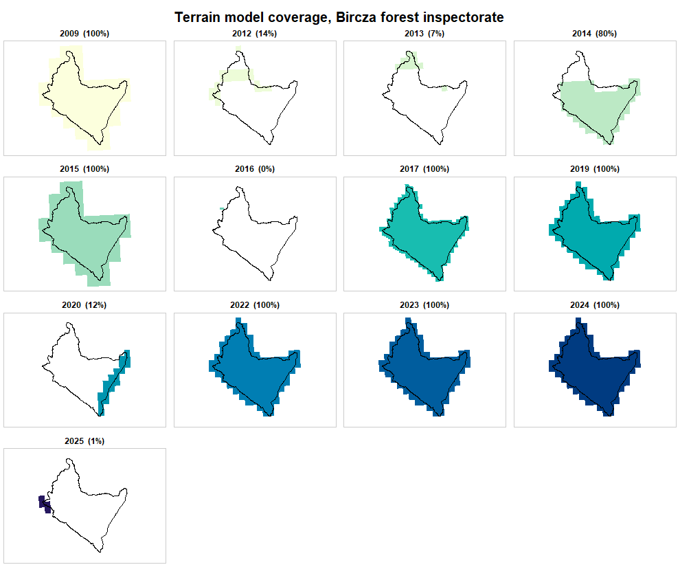
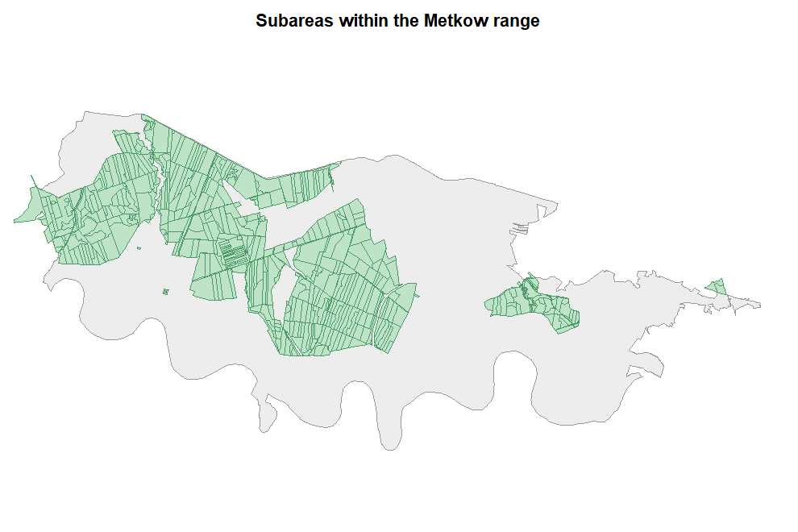

A canopy height model needs a surface model and a terrain model from the same
survey, and it needs them over the whole area. Whether that exists is a
question about the index, not about the data, and it can be settled before
downloading a single tile.

Two forest inspectorates, deliberately different: Bircza in the Carpathian
foothills, and Chrzanow in industrial Silesia.


``` r
library(rgeopl)
```

## Bircza: rich in flights, poor in usable pairs


``` r
bircza <- bdl_unit(inspectorate = "Bircza", quiet = TRUE)
round(sum(as.numeric(sf::st_area(bircza))) / 1e4)   # hectares
#> [1] 50350

dem <- dem_request(bircza, quiet = TRUE)
nrow(dem)
#> [1] 2670
```


``` r
table(dem$year, dem$product)
#>       
#>        DTM DSM PointCloud
#>   2009 120   0          0
#>   2012  46  46         53
#>   2013  22  22         52
#>   2014 190 190        345
#>   2015  40   0          0
#>   2016   1   0          0
#>   2017 417   0          0
#>   2019 136   0          0
#>   2020  20   0          0
#>   2022 129   0          0
#>   2023 129 129        450
#>   2024 129   0          0
#>   2025   4   0          0
```

Eighteen separate laser scanning flights, in four campaigns:


``` r
laz <- unique(sf::st_drop_geometry(
  dem[dem$product == "PointCloud", c("year", "date", "format", "density",
                                     "avgElevErr", "VRS")]))
laz[order(laz$date), ]
#> <rgeopl index index: 18 tiles>
#>   vintages: 2012, 2013, 2014, 2023
#>   note:     mixed vertical datums (PL-EVRF2007-NH, PL-KRON86-NH)
#>      year       date format density avgElevErr            VRS
#> 4238 2012 2012-11-07    LAS       4       0.15   PL-KRON86-NH
#> 4234 2012 2012-11-10    LAS       4       0.15   PL-KRON86-NH
#> 4729 2012 2012-11-12    LAS       4       0.15   PL-KRON86-NH
#> 4735 2012 2012-11-16    LAS       4       0.15   PL-KRON86-NH
#> 4235 2012 2012-11-17    LAS       4       0.15   PL-KRON86-NH
#> 4876 2012 2012-11-28    LAS       4       0.15   PL-KRON86-NH
#> 3137 2013 2013-04-24    LAS       4       0.15   PL-KRON86-NH
#> 3096 2013 2013-05-09    LAS       4       0.15   PL-KRON86-NH
#> 2151 2014 2014-03-21    LAS       4       0.15   PL-KRON86-NH
#> 2153 2014 2014-03-28    LAS       4       0.15   PL-KRON86-NH
#> 2152 2014 2014-03-29    LAS       4       0.15   PL-KRON86-NH
#> 2175 2014 2014-03-30    LAS       4       0.15   PL-KRON86-NH
#> 446  2023 2023-04-18    LAZ       4       0.15 PL-EVRF2007-NH
#> 27   2023 2023-04-23    LAZ       4       0.15 PL-EVRF2007-NH
#> 1    2023 2023-04-24    LAZ       4       0.15 PL-EVRF2007-NH
#> 647  2023 2023-04-28    LAZ       4       0.15 PL-EVRF2007-NH
#> 762  2023 2023-04-29    LAZ       4       0.15 PL-EVRF2007-NH
#> 742  2023 2023-05-09    LAZ       4       0.15 PL-EVRF2007-NH
```

All at 4 points per square metre. But the flights are what was surveyed, not
what was published as a surface model, and that is where it falls apart:


``` r
coverage(dem[dem$product == "DSM", ], aoi = bircza)
#>   year tiles area_km2 aoi_share
#> 1 2012    46   120.14     0.136
#> 2 2013    22    57.39     0.066
#> 3 2014   190   497.24     0.799
#> 4 2023   129   674.77     1.000
```

Only 2023 covers the inspectorate. The 2012-2014 campaign was flown in patches.


``` r
plot_coverage(dem[dem$product == "DTM", ], by = "year", aoi = bircza,
              main = "Terrain model coverage, Bircza forest inspectorate")
```

<div class="figure">

<p class="caption">plot of chunk bircza-dtm</p>
</div>

Do the early patches at least add up? Union them and measure:


``` r
old <- dem[dem$product == "DSM" & dem$year %in% c(2012, 2013, 2014), ]
g <- sf::st_make_valid(sf::st_union(aoi_geom(as_aoi(bircza))))
u <- sf::st_make_valid(sf::st_union(sf::st_geometry(old)))
covered <- suppressWarnings(sf::st_intersection(u, g))
round(100 * as.numeric(sum(sf::st_area(covered))) / as.numeric(sf::st_area(g)), 1)
#> [1] 100
```

They do -- but from three campaigns across three years, which means three
different states of the stand on one mosaic. For a single-date canopy model
over the whole inspectorate there is exactly one option, 2023.

Zoom in and it improves. A single forest range often sits inside one flight:


``` r
turnica <- bdl_unit(inspectorate = "Bircza", range = "Turnica", quiet = TRUE)
dem_t <- dem_request(turnica, quiet = TRUE)
coverage(dem_t[dem_t$product == "DSM", ], aoi = turnica)
#>   year tiles area_km2 aoi_share
#> 1 2014    16    41.88         1
#> 2 2023     8    41.88         1
```

Two complete epochs, nine years apart. That is a usable pair.

## Chrzanow: the opposite problem


``` r
metkow <- bdl_unit(inspectorate = "Chrzanow", range = "Metkow", quiet = TRUE)
dem_m <- dem_request(metkow, quiet = TRUE)

unique(sf::st_drop_geometry(
  dem_m[dem_m$product == "PointCloud",
        c("year", "date", "format", "density", "avgElevErr", "VRS")]))
#> <rgeopl index index: 5 tiles>
#>   vintages: 2012, 2022, 2023, 2024
#>   note:     mixed vertical datums (PL-EVRF2007-NH, PL-KRON86-NH)
#>     year       date format density avgElevErr            VRS
#> 1   2024 2024-05-01    LAZ      12       0.04 PL-EVRF2007-NH
#> 52  2023 2023-03-19    LAZ       4       0.15 PL-EVRF2007-NH
#> 157 2022 2022-04-13    LAZ      12       0.10 PL-EVRF2007-NH
#> 336 2012 2012-03-16    LAS       4       0.15   PL-KRON86-NH
#> 366 2012 2012-10-15    LAS       4       0.15   PL-KRON86-NH
```

Denser clouds, better vertical accuracy, five acquisitions. And yet:


``` r
coverage(dem_m[dem_m$product == "DSM", ], aoi = metkow)
#>   year tiles area_km2 aoi_share
#> 1 2012    40   103.58     1.000
#> 2 2022     4    20.71     0.193
#> 3 2023    19    98.40     0.998
#> 4 2024     4    20.71     0.193
```

The two best years, 2022 and 2024, publish a surface model over a fifth of the
range. The usable pairs are 2012 and 2023 -- the older, coarser ones.

The lesson generalises: **point cloud density and flight recency say nothing
about whether a canopy model is possible.** Surface model coverage is the
binding constraint, and it is a different column.

## Turning the question into a function


``` r
chm_epochs <- function(aoi, min_share = 0.999) {
  dem <- dem_request(aoi, quiet = TRUE)
  dsm <- coverage(dem[dem$product == "DSM", ], aoi = aoi)
  dtm <- coverage(dem[dem$product == "DTM", ], aoi = aoi)
  full <- intersect(dsm$year[dsm$aoi_share >= min_share],
                    dtm$year[dtm$aoi_share >= min_share])
  vrs <- tapply(dem$VRS, dem$year, function(z) paste(unique(z), collapse = "/"))
  data.frame(year = full, datum = unname(vrs[as.character(full)]))
}
```


``` r
chm_epochs(turnica)
#>   year          datum
#> 1 2014   PL-KRON86-NH
#> 2 2023 PL-EVRF2007-NH
chm_epochs(metkow)
#>   year        datum
#> 1 2012 PL-KRON86-NH
```

Metkow comes back with one epoch, not the two the coverage table above
suggested, and the reason is worth pausing on: its 2023 surface model covers
99.8% of the range, and the default threshold is 99.9%. That is a decision, not
a fact -- a two-per-mille gap at the edge of a range may be irrelevant, or it
may be exactly the part you care about. Make it explicitly:


``` r
chm_epochs(metkow, min_share = 0.99)
#>   year          datum
#> 1 2012   PL-KRON86-NH
#> 2 2023 PL-EVRF2007-NH
```

The datum column matters for the comparison, not for the model: a canopy height
model is a difference within one year, so the vertical datum cancels. Comparing
two terrain models across the 2019 switch would not be so forgiving.

## What the forest is, while we are here


``` r
subareas <- bdl_subareas(metkow, quiet = TRUE)
d <- sf::st_drop_geometry(subareas)
sp <- aggregate(area_ha ~ species, data = d[!is.na(d$species), ], FUN = sum)
head(sp[order(-sp$area_ha), ], 5)
#>    species area_ha
#> 10      SO 1273.60
#> 2      BRZ   94.83
#> 1       BK   77.12
#> 7       OL   27.78
#> 3       DB   15.49

round(sum(d$area_ha, na.rm = TRUE))                       # stand area, ha
#> [1] 1586
round(sum(as.numeric(sf::st_area(metkow))) / 1e4)         # range territory, ha
#> [1] 4609
```

A forest range's polygon is administrative territory, not forest. Metkow holds
1586 ha of subareas inside 4609 ha of territory; reading the polygon area as
forest area would overstate it threefold.


``` r
plot_units(subareas, label = NA, context = metkow, fill = "#bfe3c6",
           border = "#4c9a6a", main = "Subareas within the Metkow range")
```

<div class="figure">

<p class="caption">plot of chunk metkow-subareas</p>
</div>

## Summary

| | Bircza inspectorate | Turnica range | Metkow range |
|---|---|---|---|
| area | 50 350 ha | 1 197 ha | 4 609 ha |
| ALS flights | 18 | 4 | 5 |
| best density | 4 p/m² | 4 p/m² | 12 p/m² |
| **CHM epochs at 99.9%** | **2023** | **2014, 2023** | **2012** |
| **CHM epochs at 99%** | 2023 | 2014, 2023 | 2012, 2023 |

Three areas, three answers, and in none of them was the answer the newest or
the densest flight. Metkow's densest surveys, 2022 and 2024 at 12 points per
square metre, are the two that cannot be used at all: their surface models
cover a fifth of the range. That is the case for asking the index first.
