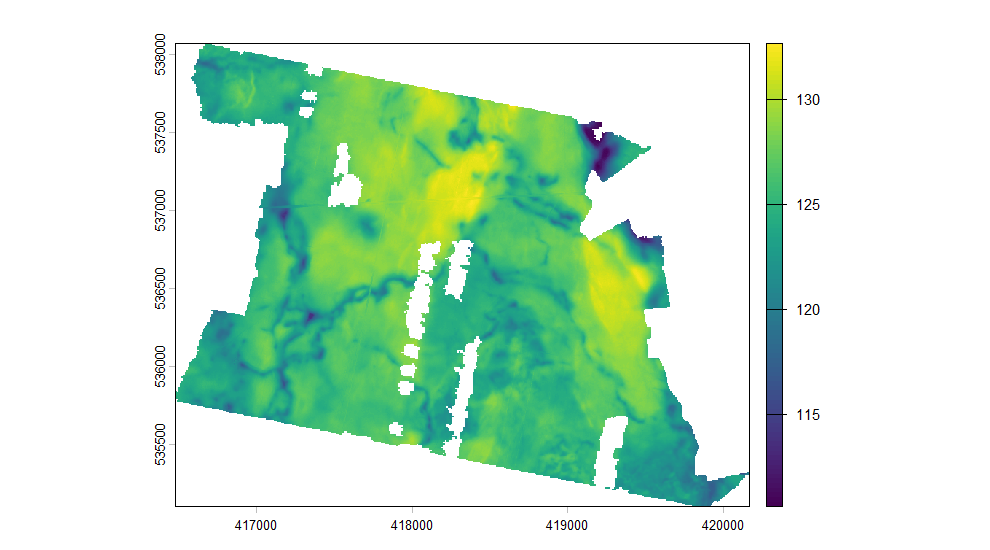
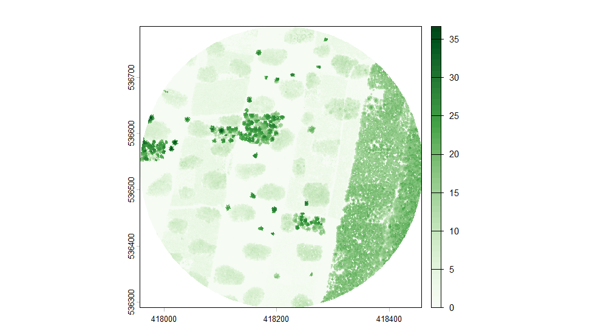
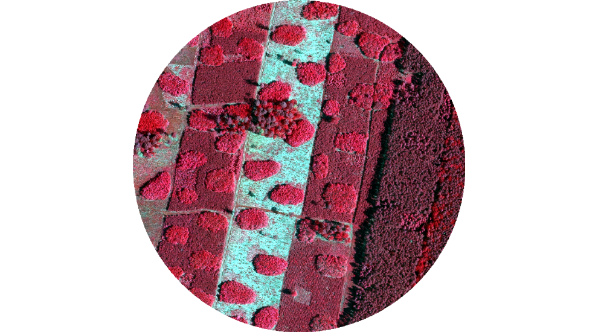
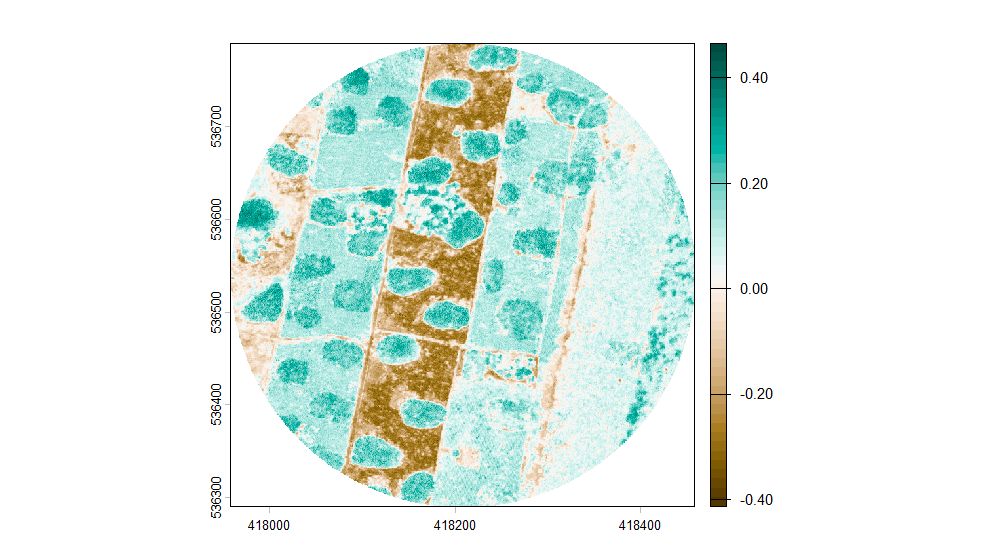

The index tells you what was flown. This is what happens after: turning a
selection into a raster you can work with, and the places where that goes
quietly wrong if nobody is looking.


``` r
library(rgeopl)
library(terra)

aoi <- as_aoi(sf::st_read(rgeopl_example("gleboczek_aoi.shp"), quiet = TRUE))
```

## One sheet, several forms

Ask for elevation and the answer is longer than it looks. The service publishes
each map sheet in more than one form, and only one of them is a raster.


``` r
dem <- dem_request(aoi, quiet = TRUE)
table(dem$product, dem$format)
#>             
#>              ARC/INFO ASCII GRID ASCII TBD ASCII XYZ GRID ESRI TIN
#>   DTM                         30         5             12        2
#>   DSM                         10         0              5        0
#>   PointCloud                   0         0              0        0
#>             
#>              Intergraph TTN LAS LAZ Warstwice DXF
#>   DTM                     2   0   0             2
#>   DSM                     0   0   0             0
#>   PointCloud              0  14  14             0
```

`ASCII XYZ GRID` is a text list of points and `ESRI TIN` is a triangulation;
neither will mosaic. `format = "grid"` keeps the one that will.


``` r
dem <- dem_request(aoi, format = "grid", quiet = TRUE)
table(dem$product, dem$year)
#>             
#>              2014 2020 2021 2023 2024 2025
#>   DTM           5    5    5    5    5    5
#>   DSM           5    0    0    0    5    0
#>   PointCloud    0    0    0    0    0    0
```

`coverage()` answers the next question — whether a vintage actually covers the
area or merely touches it.


``` r
coverage(subset(dem, product == "DTM"), by = "year", aoi = aoi)
#>   year tiles area_km2 aoi_share
#> 1 2014     5    24.47         1
#> 2 2020     5    24.47         1
#> 3 2021     5    24.47         1
#> 4 2023     5    24.47         1
#> 5 2024     5    24.47         1
#> 6 2025     5    24.47         1
```

## Joining tiles

`tile_mosaic()` downloads what the selection points at and joins it. `crop`
cuts to the area's bounding box, `mask` to its outline.


``` r
terrain <- tile_mosaic(
  subset(dem, product == "DTM" & resolution == 1 & year == 2024),
  aoi, crop = "aoi", mask = TRUE, quiet = TRUE
)

terrain
#> class       : SpatRaster
#> size        : 2974, 3685, 1  (nrow, ncol, nlyr)
#> resolution  : 1, 1  (x, y)
#> extent      : 416481.5, 420166.5, 535097.5, 538071.5  (xmin, xmax, ymin, ymax)
#> coord. ref. : ETRF2000-PL / CS92 (EPSG:2180)
#> source(s)   : memory
#> varname     : file521c4e9e1160
#> name        :        DTM
#> min value   :     110.43
#> max value   : 132.860001
plot(terrain, main = "")
```

<div class="figure">

<p class="caption">plot of chunk terrain</p>
</div>

The layer is called `DTM` rather than after the temporary file it was built
through, and that name is written into the GeoTIFF as the band description when
you pass `filename`.

It refuses more than it accepts. A selection that mixes products, vintages,
band compositions, resolutions, file formats or vertical datums is a raster
that looks finished and is not, so it comes back as an error naming what
disagreed:


``` r
tile_mosaic(subset(dem, product == "DTM"), aoi, quiet = TRUE)
#> Error:
#> ! These tiles do not belong in one mosaic. They disagree on
#>   - vintage: 2014, 2020, 2021, 2023, 2024, 2025
#>   - resolution: 1, 5
#>   - vertical datum: PL-EVRF2007-NH, PL-KRON86-NH
#> Filter the index to one of each, or pass allow_mixed = TRUE if the mixture is deliberate.
```

## Canopy height

A canopy model is one survey's surface minus its own terrain. Not every
vintage has both — the terrain is remapped far more often than the surface —
so `chm_years()` is the question to ask first.


``` r
small <- as_aoi(sf::st_centroid(sf::st_union(aoi_geom(aoi))), buffer = 250)

chm_years(small, quiet = TRUE)
#>   year resolution surface terrain
#> 2 2024          1       2       2
#> 1 2014          1       2       2
```


``` r
canopy <- chm_get(small, year = 2024, mask = TRUE, min_height = 0, quiet = TRUE)

canopy
#> class       : SpatRaster
#> size        : 500, 500, 1  (nrow, ncol, nlyr)
#> resolution  : 1, 1  (x, y)
#> extent      : 417957.5, 418457.5, 536290.5, 536790.5  (xmin, xmax, ymin, ymax)
#> coord. ref. : ETRF2000-PL / CS92 (EPSG:2180)
#> source(s)   : memory
#> varname     : file521c422f7ffc
#> name        : canopy_height
#> min value   :             0
#> max value   :     36.700005
plot(canopy, col = hcl.colors(50, "Greens", rev = TRUE), main = "")
```

<div class="figure">

<p class="caption">plot of chunk canopy</p>
</div>

Without a `year` the same function goes to the coverage services instead, which
publish the current model and hand it back already clipped. With one it
assembles the model from archive tiles, which is the only way to reach an
earlier flight.

## Four bands from two products

Orthophotos come as RGB and as false-colour infrared, and they are the same
radiometric result cut two ways: measured on one sheet, CIR's red and green
correlate with RGB's at 0.999, while its first band correlates with nothing in
RGB. So blue is the only band RGB actually adds.

`ortho_pairs()` lists the flights that published both.


``` r
ortho <- ortho_request(small, quiet = TRUE)

ortho_pairs(ortho)
#>   year resolution CIR RGB
#> 6 2025       0.25   2   2
#> 5 2023       0.25   2   2
#> 4 2021       0.25   2   2
#> 3 2016       0.50   2   3
#> 2 2013       0.50   2   2
#> 1 2010       0.50   2   3
```


``` r
nrgb <- ortho_stack(ortho, small, mask = TRUE, quiet = TRUE)

names(nrgb)
#> [1] "NIR" "R"   "G"   "B"
plotRGB(nrgb, r = 1, g = 2, b = 3, stretch = "lin")
```

<div class="figure">

<p class="caption">plot of chunk nrgb</p>
</div>

Bands one to three are near-infrared, red and green, so that is false colour:
vegetation reads red. A vegetation index wants `bands = "cir"`, which halves
the download — infrared and red already sit in one file, consistent with each
other.


``` r
ndvi <- (nrgb[["NIR"]] - nrgb[["R"]]) / (nrgb[["NIR"]] + nrgb[["R"]])
plot(ndvi, col = hcl.colors(50, "Green-Brown", rev = TRUE), main = "")
```

<div class="figure">

<p class="caption">plot of chunk ndvi</p>
</div>

## Where the chain stops

Point clouds are indexed and downloaded like everything else, but `lidR` is the
tool for what comes after, and it needs one thing the files do not carry: older
surveys leave their projection record empty.


``` r
clouds <- pointcloud_request(small, quiet = TRUE)
table(clouds$year, clouds$format)
#>       
#>        LAS LAZ
#>   2014   2   0
#>   2024   0   2
```

`pointcloud_get()` fetches the tiles and returns them with the coordinate
system the archive says they are in, one line short of a catalogue:


``` r
pc  <- pointcloud_get(subset(clouds, year == max(clouds$year)))
ctg <- lidR::readLAScatalog(pc$path)
sf::st_crs(ctg) <- pc$epsg[1]
```

## Writing it out

Every raster the package writes is DEFLATE with the predictor its data calls
for, tiled, with the band names and the coordinate system in the file. Passing
`filename` is all it takes; `gdal` replaces those defaults wholesale if you
want something else.


``` r
chm_get(small, year = 2024, mask = TRUE,
        filename = "canopy_2024.tif")

tile_mosaic(subset(dem, product == "DTM" & resolution == 1 & year == 2024), aoi,
            filename = "terrain_2024.tif",
            gdal = c("COMPRESS=ZSTD", "PREDICTOR=3", "TILED=YES"))
```
